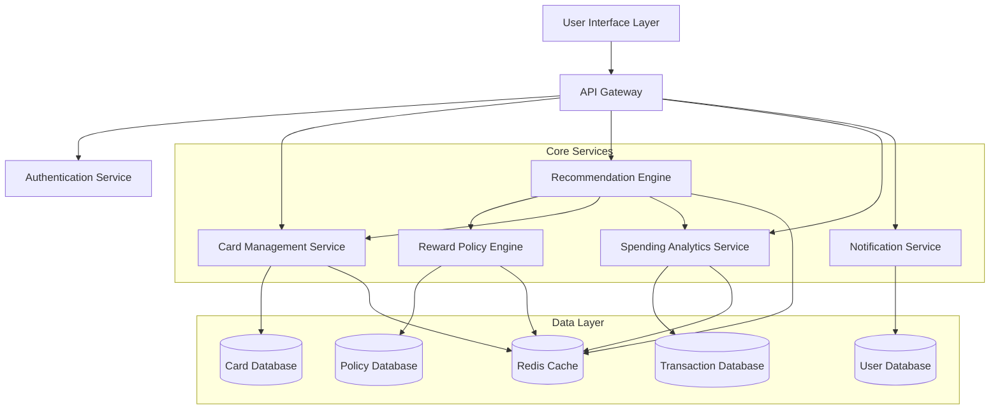

# Design Document: CardSaathi

## Overview

CardSaathi is an AI-powered recommendation system that helps Indian consumers maximize credit and debit card rewards. The system architecture follows a modular design with clear separation between data management, recommendation logic, and user interfaces.

The core innovation lies in the Recommendation Engine, which combines multiple factors—transaction category, card reward policies, user spending patterns, and milestone progress—to calculate a comprehensive Benefit Score for each card. This score-based approach enables transparent, explainable recommendations that users can trust.

### Key Design Principles

1. **Modularity**: Clear separation between card management, policy engine, recommendation logic, and user interface
2. **Extensibility**: Easy to add new card issuers, reward types, and transaction categories
3. **Privacy-First**: Minimal data collection, strong encryption, and user control over data
4. **Performance**: Sub-2-second recommendation response time through efficient caching and indexing
5. **Explainability**: Every recommendation includes a clear breakdown of how the benefit score was calculated

## Architecture

The system follows a layered architecture with the following components:



### Component Responsibilities

- **User Interface Layer**: Web and mobile interfaces for user interactions
- **API Gateway**: Routes requests, handles rate limiting, and enforces authentication
- **Authentication Service**: Manages user sessions and access control
- **Card Management Service**: CRUD operations for user cards and card details
- **Reward Policy Engine**: Stores and retrieves card-specific reward policies
- **Recommendation Engine**: Core logic for calculating benefit scores and generating recommendations
- **Spending Analytics Service**: Analyzes transaction history and identifies patterns
- **Notification Service**: Sends alerts and notifications based on triggers
- **Data Layer**: Persistent storage with caching for performance

## Components and Interfaces

### 1. Card Management Service

**Responsibilities:**
- Store and retrieve user card information
- Manage card lifecycle (add, update, remove, activate/deactivate)
- Mask sensitive card data for display

**Interface:**

```typescript
interface CardManagementService {
  // Add a new card for a user
  addCard(userId: string, cardDetails: CardInput): Promise<Card>
  
  // Get all cards for a user
  getUserCards(userId: string): Promise<Card[]>
  
  // Get a specific card by ID
  getCard(cardId: string): Promise<Card>
  
  // Update card details (e.g., mark as unavailable)
  updateCard(cardId: string, updates: CardUpdate): Promise<Card>
  
  // Remove a card
  removeCard(cardId: string): Promise<void>
  
  // Get active cards (available for recommendations)
  getActiveCards(userId: string): Promise<Card[]>
}

interface CardInput {
  cardType: 'credit' | 'debit'
  issuer: string
  lastFourDigits: string
  cardNetwork: 'Visa' | 'Mastercard' | 'RuPay' | 'Amex'
  expiryMonth: number
  expiryYear: number
  annualFee: number
  rewardPolicyId?: string
}

interface Card {
  id: string
  userId: string
  cardType: 'credit' | 'debit'
  issuer: string
  lastFourDigits: string
  cardNetwork: string
  expiryMonth: number
  expiryYear: number
  annualFee: number
  rewardPolicyId: string
  isActive: boolean
  createdAt: Date
  updatedAt: Date
}

interface CardUpdate {
  isActive?: boolean
  rewardPolicyId?: string
  annualFee?: number
}
```

### 2. Reward Policy Engine

**Responsibilities:**
- Store reward policies for different cards
- Retrieve applicable reward rates for transaction categories
- Handle policy updates and versioning

**Interface:**

```typescript
interface RewardPolicyEngine {
  // Get reward policy for a card
  getPolicy(policyId: string): Promise<RewardPolicy>
  
  // Get reward rate for a specific category
  getRewardRate(policyId: string, category: TransactionCategory): Promise<RewardRate>
  
  // Create or update a reward policy
  upsertPolicy(policy: RewardPolicyInput): Promise<RewardPolicy>
  
  // Get all available policies (for card setup)
  listPolicies(issuer?: string): Promise<RewardPolicy[]>
}

interface RewardPolicy {
  id: string
  issuer: string
  cardName: string
  categoryRates: Map<TransactionCategory, RewardRate>
  milestoneRewards: MilestoneReward[]
  spendingCaps: SpendingCap[]
  pointRedemptionValue: number // INR per point
  validFrom: Date
  validUntil?: Date
}

interface RewardRate {
  cashbackPercent: number
  rewardPointsMultiplier: number
  additionalBenefits: string[]
}

interface MilestoneReward {
  spendingThreshold: number // in INR
  rewardType: 'cashback' | 'points' | 'voucher'
  rewardValue: number
  description: string
}

interface SpendingCap {
  category: TransactionCategory
  maxCashbackPerMonth: number
  maxRewardPointsPerMonth: number
}

type TransactionCategory = 
  | 'groceries'
  | 'fuel'
  | 'dining'
  | 'travel'
  | 'online_shopping'
  | 'utilities'
  | 'entertainment'
  | 'healthcare'
  | 'general'
  | 'upi'
  | 'wallet_reload'
  | 'bill_payment'
```

### 3. Recommendation Engine

**Responsibilities:**
- Calculate benefit scores for all user cards
- Generate ranked recommendations
- Provide explanation for recommendations
- Consider user preferences and constraints

**Interface:**

```typescript
interface RecommendationEngine {
  // Get card recommendation for a transaction
  getRecommendation(request: RecommendationRequest): Promise<Recommendation>
  
  // Get detailed comparison of all cards
  compareCards(request: RecommendationRequest): Promise<CardComparison[]>
  
  // Calculate benefit score for a specific card-transaction pair
  calculateBenefitScore(
    card: Card,
    transaction: TransactionInput,
    spendingPattern: SpendingPattern,
    userPreferences: UserPreferences
  ): Promise<BenefitScore>
}

interface RecommendationRequest {
  userId: string
  amount: number
  category: TransactionCategory
  merchantName?: string
  userPreferences?: UserPreferences
}

interface Recommendation {
  recommendedCard: Card
  benefitScore: BenefitScore
  explanation: RecommendationExplanation
  alternatives: CardComparison[]
  estimatedBenefit: BenefitBreakdown
}

interface BenefitScore {
  totalScore: number
  cashbackValue: number
  rewardPointsValue: number
  milestoneProgress: number
  annualFeeImpact: number
  preferenceBonus: number
}

interface RecommendationExplanation {
  primaryReason: string
  benefitBreakdown: string[]
  milestoneContext?: string
  comparisonWithAlternatives: string[]
}

interface CardComparison {
  card: Card
  benefitScore: BenefitScore
  estimatedBenefit: BenefitBreakdown
  reasonForRanking: string
}

interface BenefitBreakdown {
  cashback: number
  rewardPoints: number
  rewardPointsValueInINR: number
  totalBenefitINR: number
  effectiveDiscountPercent: number
}

interface TransactionInput {
  amount: number
  category: TransactionCategory
  merchantName?: string
}

interface UserPreferences {
  prioritizeCashback: boolean // vs reward points
  minimumBenefitThreshold: number
  preferredCards: Map<TransactionCategory, string> // category -> cardId
  significantBenefitDifferencePercent: number // default 10%
}
```

### 4. Spending Analytics Service

**Responsibilities:**
- Record transaction history
- Analyze spending patterns
- Calculate category-wise spending
- Track milestone progress

**Interface:**

```typescript
interface SpendingAnalyticsService {
  // Record a completed transaction
  recordTransaction(transaction: Transaction): Promise<void>
  
  // Get spending pattern for a user
  getSpendingPattern(userId: string, months: number): Promise<SpendingPattern>
  
  // Get category-wise spending for current month
  getCategorySpending(userId: string, month: Date): Promise<Map<TransactionCategory, number>>
  
  // Get milestone progress for a card
  getMilestoneProgress(userId: string, cardId: string): Promise<MilestoneProgress[]>
  
  // Get monthly summary
  getMonthlySummary(userId: string, month: Date): Promise<MonthlySummary>
  
  // Check if spending cap is reached
  checkSpendingCap(userId: string, cardId: string, category: TransactionCategory): Promise<CapStatus>
}

interface Transaction {
  id: string
  userId: string
  cardId: string
  amount: number
  category: TransactionCategory
  merchantName?: string
  timestamp: Date
  benefitEarned: BenefitBreakdown
}

interface SpendingPattern {
  userId: string
  periodMonths: number
  categoryAverages: Map<TransactionCategory, number>
  totalMonthlyAverage: number
  topCategories: TransactionCategory[]
  trends: SpendingTrend[]
}

interface SpendingTrend {
  category: TransactionCategory
  direction: 'increasing' | 'decreasing' | 'stable'
  percentChange: number
}

interface MilestoneProgress {
  milestone: MilestoneReward
  currentSpending: number
  remainingSpending: number
  progressPercent: number
  projectedCompletionDate?: Date
}

interface MonthlySummary {
  month: Date
  totalSpending: number
  totalCashbackEarned: number
  totalRewardPointsEarned: number
  totalBenefitValueINR: number
  cardWiseBreakdown: CardUsageSummary[]
  optimizationOpportunities: string[]
}

interface CardUsageSummary {
  card: Card
  transactionCount: number
  totalSpending: number
  benefitsEarned: BenefitBreakdown
  utilizationPercent: number
}

interface CapStatus {
  isCapReached: boolean
  currentSpending: number
  capLimit: number
  remainingCapacity: number
}
```

### 5. Notification Service

**Responsibilities:**
- Send milestone alerts
- Notify about policy changes
- Alert on spending caps
- Suggest optimization opportunities

**Interface:**

```typescript
interface NotificationService {
  // Send a notification to a user
  sendNotification(userId: string, notification: Notification): Promise<void>
  
  // Get user notification preferences
  getPreferences(userId: string): Promise<NotificationPreferences>
  
  // Update notification preferences
  updatePreferences(userId: string, preferences: NotificationPreferences): Promise<void>
  
  // Get notification history
  getNotificationHistory(userId: string, limit: number): Promise<Notification[]>
}

interface Notification {
  id: string
  userId: string
  type: NotificationType
  title: string
  message: string
  priority: 'low' | 'medium' | 'high'
  actionUrl?: string
  createdAt: Date
  readAt?: Date
}

type NotificationType =
  | 'milestone_approaching'
  | 'milestone_achieved'
  | 'policy_change'
  | 'spending_cap_reached'
  | 'better_card_available'
  | 'underutilized_card'
  | 'annual_fee_alert'

interface NotificationPreferences {
  enableMilestoneAlerts: boolean
  enablePolicyChangeAlerts: boolean
  enableSpendingCapAlerts: boolean
  enableOptimizationSuggestions: boolean
  notificationFrequency: 'realtime' | 'daily_digest' | 'weekly_digest'
  channels: NotificationChannel[]
}

type NotificationChannel = 'push' | 'email' | 'sms' | 'in_app'
```

## Data Models

### Database Schema

**Users Table:**
```sql
CREATE TABLE users (
  id UUID PRIMARY KEY,
  email VARCHAR(255) UNIQUE NOT NULL,
  password_hash VARCHAR(255) NOT NULL,
  full_name VARCHAR(255),
  phone_number VARCHAR(20),
  created_at TIMESTAMP DEFAULT CURRENT_TIMESTAMP,
  updated_at TIMESTAMP DEFAULT CURRENT_TIMESTAMP
);
```

**Cards Table:**
```sql
CREATE TABLE cards (
  id UUID PRIMARY KEY,
  user_id UUID NOT NULL REFERENCES users(id) ON DELETE CASCADE,
  card_type VARCHAR(10) NOT NULL CHECK (card_type IN ('credit', 'debit')),
  issuer VARCHAR(100) NOT NULL,
  last_four_digits VARCHAR(4) NOT NULL,
  card_network VARCHAR(20) NOT NULL,
  expiry_month INTEGER NOT NULL CHECK (expiry_month BETWEEN 1 AND 12),
  expiry_year INTEGER NOT NULL,
  annual_fee DECIMAL(10, 2) DEFAULT 0,
  reward_policy_id UUID REFERENCES reward_policies(id),
  is_active BOOLEAN DEFAULT TRUE,
  created_at TIMESTAMP DEFAULT CURRENT_TIMESTAMP,
  updated_at TIMESTAMP DEFAULT CURRENT_TIMESTAMP,
  INDEX idx_user_cards (user_id, is_active)
);
```

**Reward Policies Table:**
```sql
CREATE TABLE reward_policies (
  id UUID PRIMARY KEY,
  issuer VARCHAR(100) NOT NULL,
  card_name VARCHAR(255) NOT NULL,
  point_redemption_value DECIMAL(10, 4) NOT NULL,
  valid_from DATE NOT NULL,
  valid_until DATE,
  created_at TIMESTAMP DEFAULT CURRENT_TIMESTAMP,
  updated_at TIMESTAMP DEFAULT CURRENT_TIMESTAMP,
  INDEX idx_issuer (issuer)
);
```

**Category Rates Table:**
```sql
CREATE TABLE category_rates (
  id UUID PRIMARY KEY,
  policy_id UUID NOT NULL REFERENCES reward_policies(id) ON DELETE CASCADE,
  category VARCHAR(50) NOT NULL,
  cashback_percent DECIMAL(5, 2) DEFAULT 0,
  reward_points_multiplier DECIMAL(5, 2) DEFAULT 0,
  additional_benefits TEXT,
  UNIQUE (policy_id, category)
);
```

**Milestone Rewards Table:**
```sql
CREATE TABLE milestone_rewards (
  id UUID PRIMARY KEY,
  policy_id UUID NOT NULL REFERENCES reward_policies(id) ON DELETE CASCADE,
  spending_threshold DECIMAL(12, 2) NOT NULL,
  reward_type VARCHAR(20) NOT NULL CHECK (reward_type IN ('cashback', 'points', 'voucher')),
  reward_value DECIMAL(10, 2) NOT NULL,
  description TEXT,
  INDEX idx_policy_milestones (policy_id)
);
```

**Spending Caps Table:**
```sql
CREATE TABLE spending_caps (
  id UUID PRIMARY KEY,
  policy_id UUID NOT NULL REFERENCES reward_policies(id) ON DELETE CASCADE,
  category VARCHAR(50) NOT NULL,
  max_cashback_per_month DECIMAL(10, 2),
  max_reward_points_per_month INTEGER,
  UNIQUE (policy_id, category)
);
```

**Transactions Table:**
```sql
CREATE TABLE transactions (
  id UUID PRIMARY KEY,
  user_id UUID NOT NULL REFERENCES users(id) ON DELETE CASCADE,
  card_id UUID NOT NULL REFERENCES cards(id),
  amount DECIMAL(12, 2) NOT NULL,
  category VARCHAR(50) NOT NULL,
  merchant_name VARCHAR(255),
  cashback_earned DECIMAL(10, 2) DEFAULT 0,
  reward_points_earned INTEGER DEFAULT 0,
  reward_points_value_inr DECIMAL(10, 2) DEFAULT 0,
  total_benefit_inr DECIMAL(10, 2) DEFAULT 0,
  transaction_date TIMESTAMP NOT NULL,
  created_at TIMESTAMP DEFAULT CURRENT_TIMESTAMP,
  INDEX idx_user_transactions (user_id, transaction_date DESC),
  INDEX idx_card_transactions (card_id, transaction_date DESC),
  INDEX idx_category_transactions (user_id, category, transaction_date DESC)
);
```

**User Preferences Table:**
```sql
CREATE TABLE user_preferences (
  user_id UUID PRIMARY KEY REFERENCES users(id) ON DELETE CASCADE,
  prioritize_cashback BOOLEAN DEFAULT FALSE,
  minimum_benefit_threshold DECIMAL(10, 2) DEFAULT 0,
  significant_benefit_difference_percent DECIMAL(5, 2) DEFAULT 10.0,
  notification_preferences JSONB,
  created_at TIMESTAMP DEFAULT CURRENT_TIMESTAMP,
  updated_at TIMESTAMP DEFAULT CURRENT_TIMESTAMP
);
```

**Preferred Cards Table:**
```sql
CREATE TABLE preferred_cards (
  id UUID PRIMARY KEY,
  user_id UUID NOT NULL REFERENCES users(id) ON DELETE CASCADE,
  category VARCHAR(50) NOT NULL,
  card_id UUID NOT NULL REFERENCES cards(id) ON DELETE CASCADE,
  UNIQUE (user_id, category)
);
```

**Notifications Table:**
```sql
CREATE TABLE notifications (
  id UUID PRIMARY KEY,
  user_id UUID NOT NULL REFERENCES users(id) ON DELETE CASCADE,
  notification_type VARCHAR(50) NOT NULL,
  title VARCHAR(255) NOT NULL,
  message TEXT NOT NULL,
  priority VARCHAR(10) NOT NULL CHECK (priority IN ('low', 'medium', 'high')),
  action_url TEXT,
  read_at TIMESTAMP,
  created_at TIMESTAMP DEFAULT CURRENT_TIMESTAMP,
  INDEX idx_user_notifications (user_id, created_at DESC)
);
```

### Caching Strategy

**Redis Cache Keys:**

- `user:cards:{userId}` - List of user's cards (TTL: 1 hour)
- `policy:{policyId}` - Reward policy details (TTL: 24 hours)
- `spending:pattern:{userId}` - User spending pattern (TTL: 1 hour)
- `spending:monthly:{userId}:{month}` - Monthly category spending (TTL: 6 hours)
- `milestone:progress:{userId}:{cardId}` - Milestone progress (TTL: 1 hour)
- `cap:status:{userId}:{cardId}:{category}` - Spending cap status (TTL: 30 minutes)

Cache invalidation occurs on:
- Card addition/removal/update
- Policy updates
- Transaction recording
- User preference changes


## Correctness Properties

*A property is a characteristic or behavior that should hold true across all valid executions of a system—essentially, a formal statement about what the system should do. Properties serve as the bridge between human-readable specifications and machine-verifiable correctness guarantees.*

### Property 1: Card Addition Round Trip

*For any* valid card details, adding a card then retrieving it should return all the original card information with the user association intact and card numbers properly masked for display.

**Validates: Requirements 1.1, 1.2, 1.3**

### Property 2: Card Removal Completeness

*For any* card that exists in the system, removing it should result in the card being absent from all user card lists and excluded from all future recommendation requests.

**Validates: Requirements 1.4**

### Property 3: Reward Policy Persistence

*For any* reward policy with category rates, milestone rewards, and spending caps, storing the policy then retrieving it should return all policy components with complete data for all categories.

**Validates: Requirements 2.1, 2.2, 2.5**

### Property 4: Policy Update Propagation

*For any* card with an associated reward policy, updating the policy's reward rates should result in all subsequent recommendations using the new rates rather than the old rates.

**Validates: Requirements 2.3**

### Property 5: Category Classification Consistency

*For any* transaction details provided by a user, the system should assign exactly one transaction category from the supported category list.

**Validates: Requirements 3.1**

### Property 6: Manual Category Override

*For any* recommendation request with a manually specified category, the recommendation should use that category regardless of what automatic classification would suggest.

**Validates: Requirements 3.4**

### Property 7: Benefit Score Calculation Completeness

*For any* card and transaction pair, the calculated benefit score should include contributions from cashback value, reward points value (converted to INR), milestone progress, and annual fee impact.

**Validates: Requirements 4.1, 6.1**

### Property 8: Highest Benefit Score Recommendation

*For any* set of user cards and a transaction request, the recommended card should be the one with the highest benefit score, or if multiple cards tie for highest score, the one with the lowest annual fee.

**Validates: Requirements 4.2, 4.3**

### Property 9: Recommendation Ranking Order

*For any* recommendation response with alternatives, the alternative cards should be sorted in descending order by their benefit scores.

**Validates: Requirements 4.6**

### Property 10: Benefit Breakdown Completeness

*For any* recommendation, the response should include a complete benefit breakdown showing cashback amount, reward points earned, reward points value in INR, and total benefit in INR.

**Validates: Requirements 4.5**

### Property 11: Transaction Recording Completeness

*For any* completed transaction, recording it should store all transaction details including amount, category, card used, timestamp, and benefits earned.

**Validates: Requirements 5.1**

### Property 12: Category Spending Aggregation

*For any* set of transactions in a given month, the calculated category spending totals should equal the sum of all transaction amounts within each category.

**Validates: Requirements 5.2**

### Property 13: Spending Cap Impact on Benefit Score

*For any* card approaching or at its spending cap for a category, the benefit score for transactions in that category should be reduced compared to the same card with available cap capacity.

**Validates: Requirements 5.5**

### Property 14: Reward Points Conversion Consistency

*For any* card with a defined point redemption value, calculating the benefit score should convert reward points to INR using that card's specific redemption rate.

**Validates: Requirements 6.2**

### Property 15: Milestone Progress Benefit Boost

*For any* card close to achieving a milestone reward, the benefit score should include the amortized value of milestone progress for transactions that advance toward that milestone.

**Validates: Requirements 6.3**

### Property 16: Annual Fee Amortization

*For any* card with an annual fee, the benefit score calculation should reduce the net benefit by the amortized fee amount based on expected annual spending.

**Validates: Requirements 6.4**

### Property 17: Cashback Priority Preference

*For any* user with cashback prioritization enabled, when comparing two cards with equal total benefit value but different cashback vs points composition, the card with higher cashback should have a higher benefit score.

**Validates: Requirements 7.1**

### Property 18: Inactive Card Exclusion

*For any* card marked as inactive or unavailable, that card should not appear in recommendation results regardless of its benefit score.

**Validates: Requirements 7.2**

### Property 19: Minimum Benefit Threshold Filtering

*For any* user with a minimum benefit threshold set, all recommended cards should have benefit scores that meet or exceed that threshold.

**Validates: Requirements 7.3**

### Property 20: Category Preference Override

*For any* user with a preferred card for a specific category, that card should be recommended for transactions in that category unless another card offers benefits exceeding the significant difference threshold.

**Validates: Requirements 7.5**

### Property 21: Milestone Proximity Notification

*For any* user whose spending on a card is within 10% of a milestone threshold, a notification should be generated alerting them of the proximity to the milestone.

**Validates: Requirements 8.1**

### Property 22: Policy Change Notification

*For any* reward policy update affecting a user's card, a notification should be created for that user indicating the policy change.

**Validates: Requirements 8.2**

### Property 23: Spending Cap Notification

*For any* card that reaches its spending cap for a category, a notification should be immediately generated informing the user that the cap has been reached.

**Validates: Requirements 8.3**

### Property 24: Card Data Encryption at Rest

*For any* card details stored in the database, the sensitive fields should be encrypted using AES-256 encryption and not stored in plaintext.

**Validates: Requirements 9.1**

### Property 25: Card Number Minimization

*For any* card stored in the system, only the last four digits of the card number should be stored, never the full card number.

**Validates: Requirements 9.3**

### Property 26: Account Deletion Completeness

*For any* user account that is deleted, all associated data including cards, transactions, preferences, and notifications should be permanently removed from the system.

**Validates: Requirements 9.4**

### Property 27: Authorization Enforcement

*For any* request to access user data, the request should be rejected if the requester is not authenticated or is attempting to access data belonging to a different user.

**Validates: Requirements 9.6**

### Property 28: Recommendation Explanation Completeness

*For any* recommendation response, the explanation should include benefit breakdown, calculation methodology, spending pattern context, milestone progress, and comparative reasons for alternative card rankings.

**Validates: Requirements 10.1, 10.2, 10.3, 10.4**

### Property 29: Portfolio Coverage Gap Identification

*For any* user card portfolio, analyzing the portfolio should identify transaction categories where the user has no cards or has cards with below-average reward rates.

**Validates: Requirements 11.1**

### Property 30: Card Utilization Analysis

*For any* user with multiple cards, the monthly summary should identify which cards are underutilized (low transaction count relative to potential benefits) and which are overutilized.

**Validates: Requirements 11.3**

### Property 31: Portfolio Value Calculation

*For any* user's card portfolio and spending pattern, the calculated annual portfolio value should equal the sum of expected benefits from all cards based on category spending projections.

**Validates: Requirements 11.4**

### Property 32: Negative ROI Alert

*For any* card where the annual fee exceeds the total benefits earned over the past 12 months, an alert should be generated suggesting the user consider alternatives.

**Validates: Requirements 11.5**

### Property 33: GST Application on Redemptions

*For any* reward redemption where GST is applicable, the final redemption value should include the appropriate GST calculation based on Indian tax regulations.

**Validates: Requirements 12.4**

## Error Handling

### Error Categories

**1. Validation Errors:**
- Invalid card details (expired cards, invalid card numbers)
- Invalid transaction amounts (negative or zero values)
- Invalid category selections
- Invalid policy configurations (negative rates, invalid thresholds)

**Error Response:**
```typescript
{
  error: "VALIDATION_ERROR",
  message: "Human-readable error message",
  field: "fieldName",
  code: "SPECIFIC_ERROR_CODE"
}
```

**2. Not Found Errors:**
- Card not found
- User not found
- Policy not found
- Transaction not found

**Error Response:**
```typescript
{
  error: "NOT_FOUND",
  message: "Resource not found",
  resourceType: "card" | "user" | "policy" | "transaction",
  resourceId: "id"
}
```

**3. Authorization Errors:**
- Unauthenticated requests
- Unauthorized access to other users' data
- Insufficient permissions

**Error Response:**
```typescript
{
  error: "AUTHORIZATION_ERROR",
  message: "Access denied",
  code: "UNAUTHORIZED" | "FORBIDDEN"
}
```

**4. Business Logic Errors:**
- Spending cap exceeded
- Card limit reached (max 20 cards per user)
- Inactive card used in transaction
- Policy conflict or inconsistency

**Error Response:**
```typescript
{
  error: "BUSINESS_LOGIC_ERROR",
  message: "Human-readable explanation",
  code: "SPECIFIC_BUSINESS_ERROR_CODE",
  context: { /* relevant context data */ }
}
```

**5. System Errors:**
- Database connection failures
- Cache unavailable
- External service timeouts
- Unexpected exceptions

**Error Response:**
```typescript
{
  error: "SYSTEM_ERROR",
  message: "An unexpected error occurred",
  requestId: "unique-request-id",
  timestamp: "ISO-8601 timestamp"
}
```

### Error Handling Strategies

**Graceful Degradation:**
- If cache is unavailable, fall back to database queries
- If spending pattern analysis fails, use default weights in benefit score calculation
- If notification service is down, queue notifications for later delivery

**Retry Logic:**
- Database operations: 3 retries with exponential backoff
- External API calls: 2 retries with 1-second delay
- Cache operations: No retries (fail fast to database)

**Circuit Breaker:**
- External services: Open circuit after 5 consecutive failures
- Half-open state after 30 seconds
- Close circuit after 2 successful requests

**Logging:**
- All errors logged with severity level (ERROR, WARN, INFO)
- Include request ID, user ID (if available), timestamp, and stack trace
- PII (card numbers, personal details) excluded from logs

## Testing Strategy

### Dual Testing Approach

CardSaathi requires both unit tests and property-based tests for comprehensive coverage:

**Unit Tests** focus on:
- Specific examples demonstrating correct behavior
- Edge cases (empty lists, boundary values, null handling)
- Error conditions and validation
- Integration points between components
- Specific Indian market scenarios (UPI, specific issuers)

**Property-Based Tests** focus on:
- Universal properties that hold for all inputs
- Comprehensive input coverage through randomization
- Invariants that must always be maintained
- Round-trip properties (store/retrieve, serialize/deserialize)
- Relationship properties between components

Both testing approaches are complementary and necessary. Unit tests catch concrete bugs and verify specific scenarios, while property tests verify general correctness across a wide input space.

### Property-Based Testing Configuration

**Framework Selection:**
- **TypeScript/JavaScript**: fast-check
- **Python**: Hypothesis
- **Java**: jqwik

**Test Configuration:**
- Minimum 100 iterations per property test (due to randomization)
- Each property test must reference its design document property
- Tag format: `Feature: card-saathi, Property {number}: {property_text}`

**Example Property Test Structure:**

```typescript
import fc from 'fast-check';

// Feature: card-saathi, Property 1: Card Addition Round Trip
describe('Card Management Properties', () => {
  it('should preserve all card details in add-retrieve round trip', () => {
    fc.assert(
      fc.property(
        fc.record({
          cardType: fc.constantFrom('credit', 'debit'),
          issuer: fc.string({ minLength: 1, maxLength: 100 }),
          lastFourDigits: fc.string({ minLength: 4, maxLength: 4 }),
          cardNetwork: fc.constantFrom('Visa', 'Mastercard', 'RuPay', 'Amex'),
          annualFee: fc.nat({ max: 50000 })
        }),
        async (cardDetails) => {
          const userId = await createTestUser();
          const addedCard = await cardService.addCard(userId, cardDetails);
          const retrievedCard = await cardService.getCard(addedCard.id);
          
          expect(retrievedCard.cardType).toBe(cardDetails.cardType);
          expect(retrievedCard.issuer).toBe(cardDetails.issuer);
          expect(retrievedCard.lastFourDigits).toBe(cardDetails.lastFourDigits);
          expect(retrievedCard.userId).toBe(userId);
          expect(retrievedCard.lastFourDigits.length).toBe(4); // masked
        }
      ),
      { numRuns: 100 }
    );
  });
});
```

### Test Coverage Requirements

**Minimum Coverage Targets:**
- Line coverage: 80%
- Branch coverage: 75%
- Function coverage: 85%
- Critical paths (recommendation engine, benefit calculation): 95%

### Testing Phases

**1. Unit Testing Phase:**
- Test individual functions and methods
- Mock external dependencies
- Focus on business logic correctness
- Test error handling and edge cases

**2. Property Testing Phase:**
- Implement all 33 correctness properties as property-based tests
- Each property maps to specific requirements
- Run with minimum 100 iterations
- Verify invariants hold across random inputs

**3. Integration Testing Phase:**
- Test component interactions
- Use test database and cache instances
- Verify end-to-end flows
- Test API endpoints with various scenarios

**4. Performance Testing Phase:**
- Verify recommendation response time < 2 seconds
- Test with realistic data volumes (1000+ cards, 10000+ transactions)
- Load testing with concurrent users
- Cache effectiveness measurement

**5. Security Testing Phase:**
- Verify encryption at rest and in transit
- Test authentication and authorization
- Penetration testing for common vulnerabilities
- Data privacy compliance verification

### Test Data Management

**Generators for Property Tests:**
- Card generator: Random valid card details
- Policy generator: Random reward policies with valid rates
- Transaction generator: Random transactions with valid amounts and categories
- User generator: Random user profiles
- Spending pattern generator: Realistic spending distributions

**Test Database:**
- Separate test database instance
- Seed data for integration tests
- Automated cleanup after test runs
- Realistic Indian card issuer data

**Mock Data:**
- Sample reward policies from major Indian issuers (HDFC, ICICI, SBI, Axis)
- Representative transaction categories and amounts
- Typical spending patterns for Indian consumers

### Continuous Testing

**Pre-commit Hooks:**
- Run unit tests
- Run linting and type checking
- Verify code coverage thresholds

**CI/CD Pipeline:**
- Run all unit tests
- Run property-based tests (100 iterations)
- Run integration tests
- Generate coverage reports
- Security scanning
- Performance benchmarks

**Monitoring in Production:**
- Track recommendation accuracy
- Monitor response times
- Alert on error rates
- Track user satisfaction metrics
